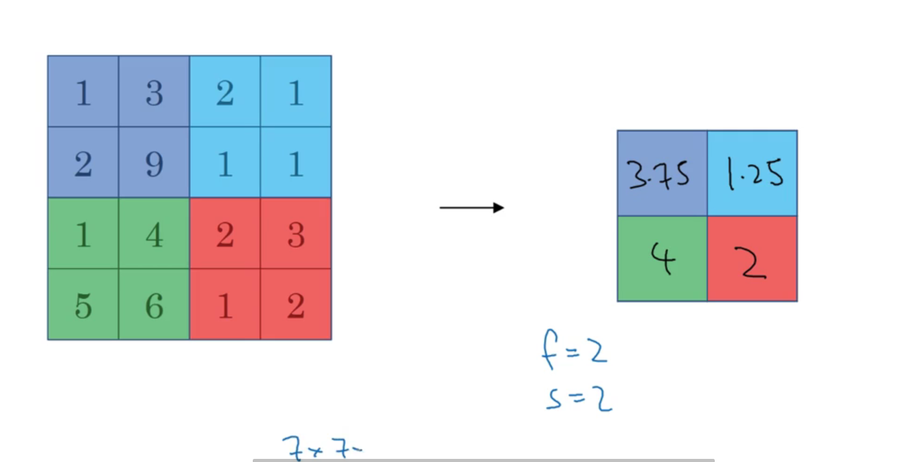

# 《深度学习》学习笔记 _最大池化和平均池化

## 最大池化：

一张网格4 X 4，然后映射到2 X 2 的网格上。最大池化就是在4 X 4的网格上每次选出最大的那个数字，然后放入到2 X 2的网格对应位置。其中4 X 4网格是原始的图片，2 X 2网格是过滤器，步幅为1。

计算过滤后的输出维数公式：

$\frac{n+2p-f}{s}+1$，其中$f$为过滤器维数，$s$也就过滤器在原图上移动的步长，

## 平均池化：

取平均数填入即可

$f$：过滤器大小（维数）

$s$:步幅（过滤器每次移动的格数）

$p$: padding :dizzy_face:

